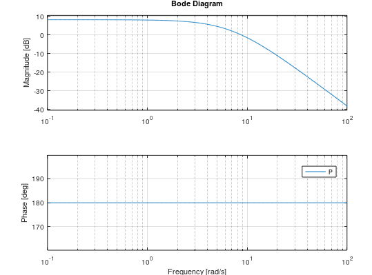
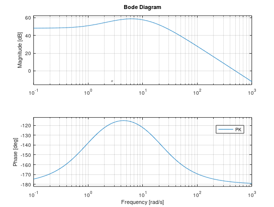
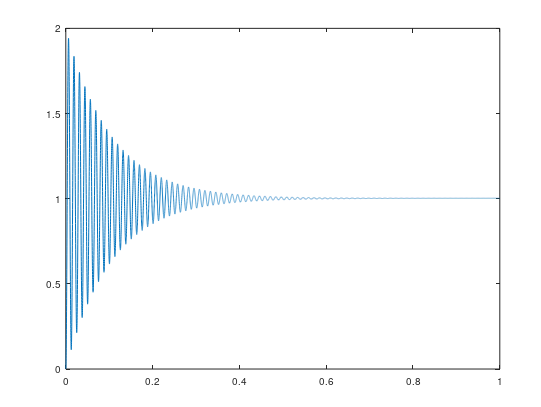
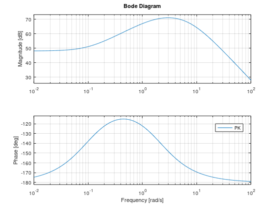
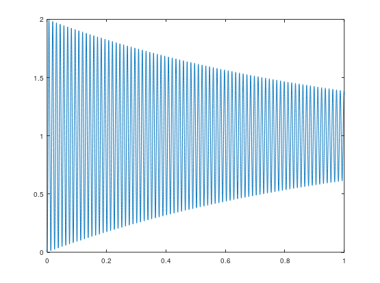
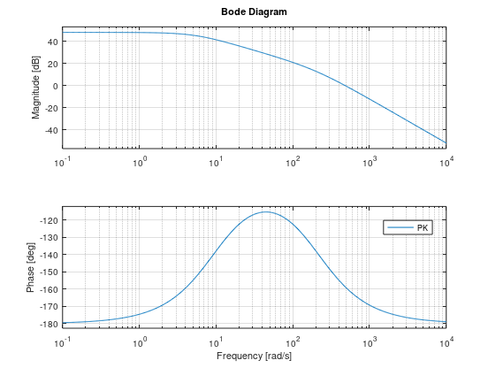
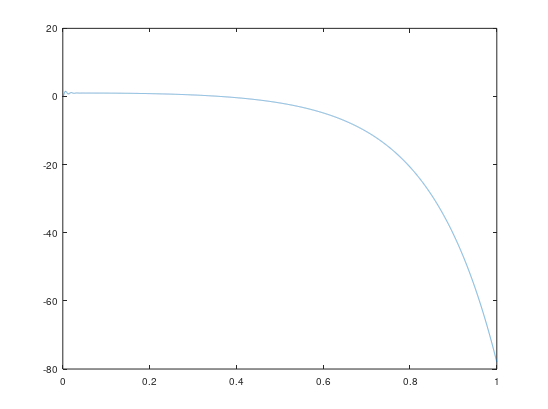
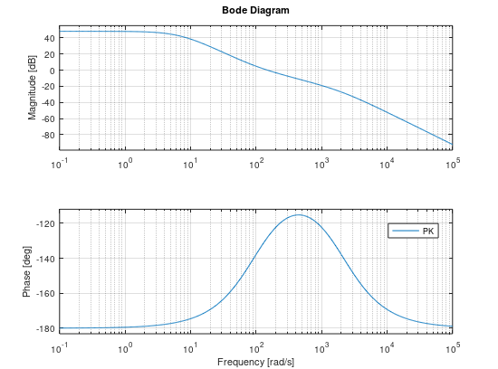
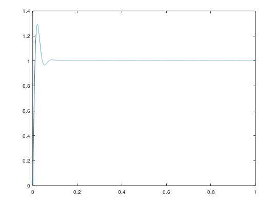
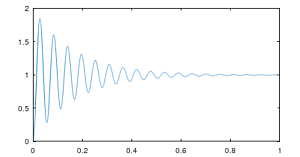

# 回転型倒立振子の制御

## システムのモデル
回転型倒立振子を制御により安定させる。
線形近似しちゃう。

$L = 200[mm]$

$m = 200[g]$

### 運動方程式
- 並進方向
    - $m\frac{d^2x}{dt^2}=N \sin\theta + \frac{\tau}{L}$ … [1]
    - $m\frac{d^2y}{dt^2}=-mg + N \cos\theta$ …[2]
- 回転方向
    - $m L^2\frac{d^2\theta}{dt^2}=-mgL \sin\theta + \tau $…[3]

線形近似すると、$\sin\theta \fallingdotseq \theta$, $\cos\theta \fallingdotseq 1$ なので、
[2] から $N = mg$ となり、
[1][3] から同じ式がでてくる。
$$m L^2 \frac{d^2\theta}{dt^2}= mgL\theta + \tau$$

### 伝達関数

運動方程式をラプラス変換して、伝達関数を求める。
$$m L^2 s^2\theta= mgL\theta + \tau$$
$$\theta = \frac{1}{mL^2s^2 - mgL}\tau$$

MKSA系で実際の値を代入する。
$m = 200[g] = 0.2$, 
$L = 200mm = 0.2$, 
$g = 9.8[kg \cdot m \cdot s^{-2}] \fallingdotseq 10$

$$\theta = \frac{1}{0.0008s^2 - 0.4}\tau$$

### ボード線図

システムのボード線図はこうなる。

## PD補償によるフィードバック制御

PD制御を付加する。

$K_{PD}(s) = \frac{K_P(1+T_Ds)}{1+(T_D/N)s}$

### $T_D$とシステムの挙動の関係

- ちょうど固有振動数付近を微分するようにしてみる。
  - $T_D = 1$, $N_d = 20$
  - 一巡伝達関数のボード線図とこの時のステップ応答。100Hzくらいで振動しながら減衰しているように見える。

 

- 低い周波数から微分が効くようにする。
  - $T_D = 10$, $N_d = 20$
  - 一巡伝達関数のボード線図とこの時のステップ応答。なんだか…。

 

- 高い周波数で微分が効くようにする。
  - $T_D = 0.1$, $N_d = 20$
  - ステップ応答は一瞬収束するのだけれど、しばらくすると落ちてくる…。数値的な問題かもしれないけれど、積分が入ってないことが原因?

 

- 更に高い周波数で微分が効くようにする。
  - $T_D = 0.01$, $N_d = 20$
  - この時のステップ応答。なんか安定してくる。

 

- じゃぁ$T_D$ を小さくしていけばいいかというとそうでもなく、
  - また発振気味になる。
  - $T_D = 0.001$, $N_d = 20$

このときの周波数は、$T_D$が大きい時とは違ってるので支配的な項が変わってるように見える。

